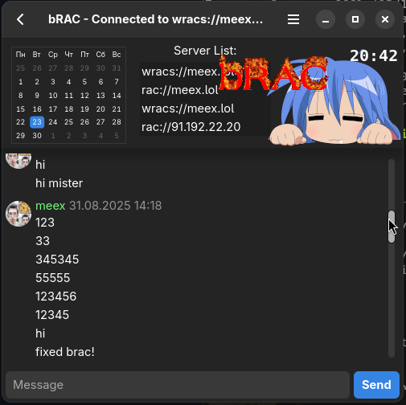

# 
<!--
[]()
[]()
[](https://meex.lol/bitcoin)
-->

better RAC client

## features

- gtk4 (libadwaita) modern GUI
- RACv1.99.x and RACv2.0 compatible
- WRAC compatible ([docs](docs/wrac.md))
- avatars drawing ([docs](docs/avatars.md))
- chat commands (type /help)
- no ip and date visible for anyone (almost)
- libtesl environment support
- coloring usernames by their clients (CRAB, clRAC, Mefidroniy, etc.)
- many command-line options (see --help)
- rich configuration (--config-path to get file path)
- RACS/WRACS compatible (ex: wracs://meex.lol)
- reading messages chunked (less traffic usage)



## how to run

### download binary

go to [releases](https://github.com/MeexReay/bRAC/releases/latest) and download file you need. its simple.

### install (for linux)

1. Install requirements: `gtk4-dev gtk4 make rust git openssl-dev openssl`

2. Clone repository and run `make install`

3. Now you are able to start bRAC with desktop icon

### build from source

1. Make sure [Rust](https://www.rust-lang.org/tools/install) is installed

2. Clone repository
```bash
git clone https://github.com/MeexReay/bRAC.git
cd bRAC
```

3. Run with Cargo
```bash
cargo build -r # build release (target/release/bRAC)
```

Read more about that on the [compiling docs](docs/compiling.md).

### nixos installation

If you have Nix package manager installed, you can use:

```bash
nix build github:MeexReay/bRAC # build release (result/bin/bRAC)
nix run github:MeexReay/bRAC # build and run
```

To install, you need to make [a flake for system](https://nixos.wiki/wiki/flakes#Using_nix_flakes_with_NixOS)
Example of the installation: [my dotfiles commit](https://git.meex.lol/MeexReay/dotfiles-nix/commit/ea4c8f18a54da8ae2d260bc714873a877f8e79e0)

## chat commands

commands are any messages that start with a slash `/` \
messages starting with a slash are sent to chat only if the `--disable-commands` option is specified

- `/help` - show help message
- `/register password` - try to register account
- `/login password` - login to account
- `/clear` - clear chat
- `/spam *args` - spam with text
- `/ping` - get server ping (send + read)

## docs

- [Compiling](docs/compiling.md)
- [Avatars](docs/avatars.md)
- [User agents](docs/user_agents.md)
- [Using as crate](docs/crate.md)
- [Authenticated mode](docs/auth_mode.md)
- [WRAC protocol (v2.0)](docs/wrac.md)
- [About RAC URL](docs/url.md)
- [FAQ](docs/faq.md)

## see also

- [Racinfo - webpage with info about RAC](https://racinfo.meex.lol/)
- [RAC-Hub - all about RAC protocol](https://meexreay.github.io/RAC-Hub/)
- [RAC protocol (v2.0)](https://gitea.bedohswe.eu.org/pixtaded/crab#rac-protocol)
- [CRAB - client & server for RAC](https://gitea.bedohswe.eu.org/pixtaded/crab)
- [Mefidroniy - TUI client for RAC](https://github.com/OctoBanon-Main/mefedroniy-client)
- [cRACk - client for RAC kettles](https://github.com/pansangg/cRACk)
- [AlmatyD - server for RACv1.0](https://gitea.bedohswe.eu.org/bedohswe/almatyd)
- [RAC protocol (v1.0)](https://bedohswe.eu.org/text/rac/protocol.md.html)
